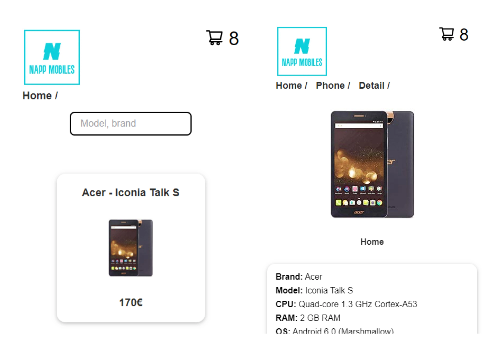

      

# Napp Mobiles

> Get your next phone here!
> Live demo [_here_](https://napp-mobiles-xsb.netlify.app/). <!-- If you have the project hosted somewhere, include the link here. -->

## Table of Contents

- [General Info](#general-information)
- [Technologies Used](#technologies-used)
- [Features](#features)
- [Screenshots](#screenshots)
- [Setup](#setup)
- [Project Status](#project-status)
- [Contact](#contact)
<!-- * [License](#license) -->

## General Information

Welcome to Napp Mobiles, a simple application that allows users to view a list of products and their details. This project is built with React and is intended as a demonstration of how to create a mobile app with basic features such as a product list and details, and the ability to add items to a shopping cart.

## Technologies Used

- React
- Jest
- React Testing Library
- StyledComponents
- MSW
- React Router Dom
- Cypress
- Lint-staged

## Features

- Get a list of phones.
- Get detailed information about the phone you choose.
- Filter phones.
- Shopping cart with total items.

## Screenshots

## Setup

### `npm start`

Runs the app in the development mode.\
Open [http://localhost:3000](http://localhost:3000) to view it in your browser.

The page will reload when you make changes.\
You may also see any lint errors in the console.

### `npm test`

Launches the test runner in the interactive watch mode.\

### `npm run lint`

Launches the linter.\

### `npm run build`

Builds the app for production to the `build` folder.\
It correctly bundles React in production mode and optimizes the build for the best performance.

The build is minified and the filenames include the hashes.\
Your app is ready to be deployed!

### `npm run eject`

**Note: this is a one-way operation. Once you `eject`, you can't go back!**

If you aren't satisfied with the build tool and configuration choices, you can `eject` at any time. This command will remove the single build dependency from your project.

Instead, it will copy all the configuration files and the transitive dependencies (webpack, Babel, ESLint, etc) right into your project so you have full control over them. All of the commands except `eject` will still work, but they will point to the copied scripts so you can tweak them. At this point you're on your own.

You don't have to ever use `eject`. The curated feature set is suitable for small and middle deployments, and you shouldn't feel obligated to use this feature. However we understand that this tool wouldn't be useful if you couldn't customize it when you are ready for it.

## Project Status

Project is: _Done_

## Contact

Created by [Xavi](https://www.linkedin.com/in/xaviersansb/) - feel free to contact me!
